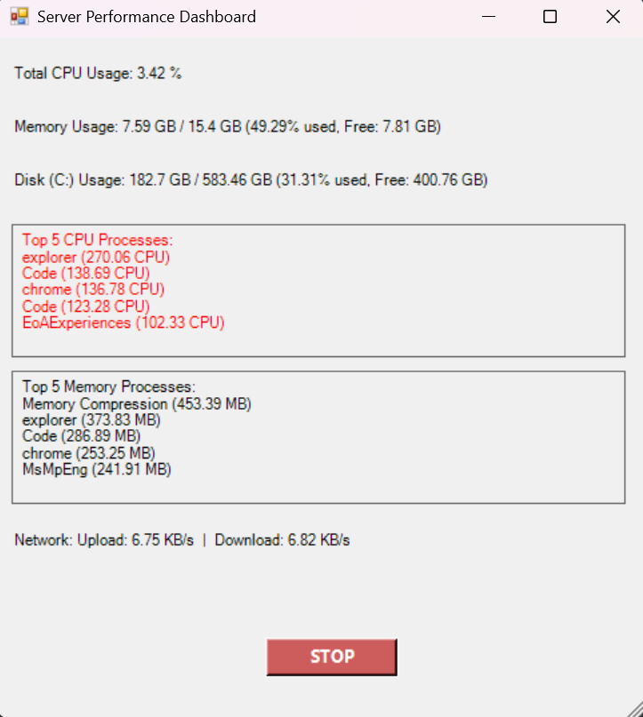

# 🖥️ Server Performance Dashboard (Windows)

A **PowerShell GUI tool** to monitor server performance in real-time on Windows systems.  
The dashboard displays **CPU, memory, disk, and network usage**, along with the **top processes** by CPU and memory.

---

## Features

- Real-time updates every **3 seconds**  
- **CPU Usage**: Total CPU and top 5 CPU-consuming processes  
- **Memory Usage**: Total, used, free memory, and top 5 memory-consuming processes  
- **Disk Usage**: C: drive usage (used, free, total)  
- **Network Usage**: Upload and download speed in KB/s  
- Highlights high CPU (>20%) or high memory (>500 MB) processes in **red**  
- **STOP button** to safely close the dashboard  

---

##  Prerequisites

- **Windows OS**  
- **PowerShell 5.1+** (default on modern Windows)  
- .NET Framework (required for Windows Forms)  

No additional installations required.

---

##  Quick Start

1. Open **PowerShell**.  
2. Navigate to the folder containing the script:
   ```powershell
   cd path\to\script
Run the script:

.\Server-Performance-Dashboard.ps1


The GUI window will open and start showing live server stats.

Click STOP to safely close the dashboard.

 If GUI issues occur, run the script with:

powershell.exe -STA -ExecutionPolicy Bypass -File "C:\Path\To\Server-Performance-Dashboard.ps1"

Screenshots
<p align="center">
  
</p>
